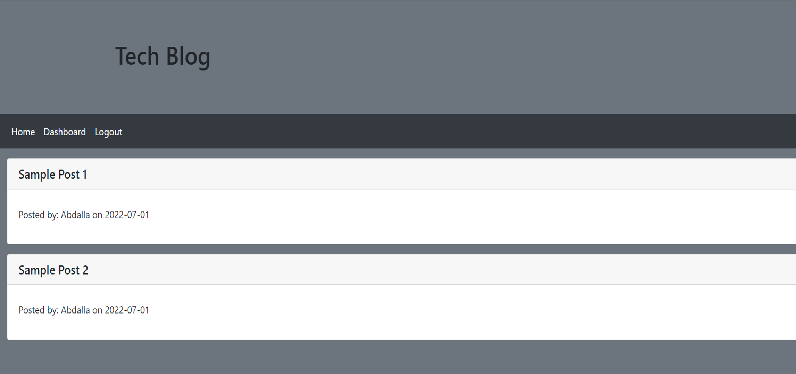

# Model-View-Controller (MVC) Challenge: Tech Blog

## Description

This project is a CMS style blog with a frontend powered by handlebar.js and bootstrap and a backend powered by node.js, express.js and MySQL.

This website can be useful to anyone who would like to have a place to post articles or thoughts or any form of written content. In addition to being able to publish the user would also be able to post comments on their own content as well as content posted by others.

## Table of Contents
- [Description](#description)
- [Usage](#usage)
- [License](#license)
- [Questions](#questions)

## Usage

The website is live on the open web and can be accessed at https://tech-blog-abdalla.herokuapp.com/ 

When a user opens the webpage they can see all of the posts that have been created. Clicking on any link other than home will direct the user to login or sign-up. Once the user is logged in they are sent to a dashboard, where they can view their own posts and create new ones. From the dashboard a user can click their post to modify or delete it. From the home page a user can now click on any post and see its contents and comments. The user is also able to add comments.

A photo of the mockup is available below.
 

## License

This project is under the MIT license at [MIT](https://opensource.org/licenses/MIT)

## Questions

If you have additional questions please feel free to reach out.

Github: https://www.github.com/abdallajama201

